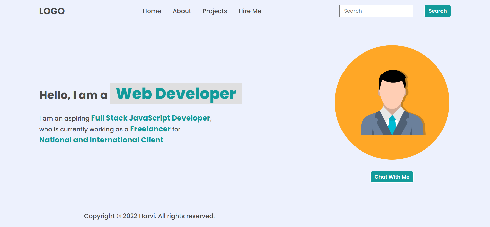

### before any changes the project was look like this :-


## Assignment One 

### task 1: add "Hire Me" in the navbar after "projects"


>solution:-
```
let newElement = document.createElement("li");
newElement.innerHTML ="<a>Hire Me</a>"
document.querySelector("header nav ul").appendChild(newElement);
```

### task 2: Replace the search's placeholder "search" to "Search My Project"


>solution:-
```
let search = document.querySelector(".search-field input");
search.placeholder = "Search My Project"
```

### task 3: Manipulating hero section's details


>solution:-
```
let details = document.querySelector(".hero-left-section p span:last-child");
details.innerText = "iNeuron Intelligence Pvt Ltd"
```

### task 4: Change the profile picture


>solution:-
```
let profile = document.querySelector(".hero-right-section img");
profile.src = "./assets/pic.jpeg"

```

### task 5: Add a "Support Me" button after "Chat With Me" button


>solution:-
```
let supportBtn = document.createElement("button");
supportBtn.innerText = "Support Me";
document.querySelector(".hero-right-section-btns").appendChild(supportBtn);
```