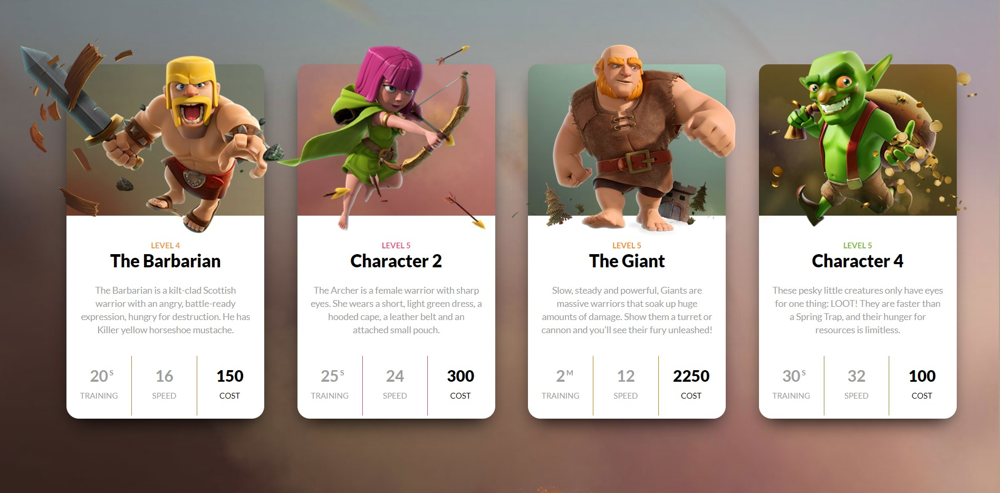

### DOM PROJECT NO 4 :-
> BEFORE :-



> AFTER :-


## Here how I apporached for this problem :-

> 1. Here first i have target all the cards power-details and changed the background color 

```
let barbayian = document.querySelector(".clash-card__unit-stats--barbarian");
let archer = document.querySelector(".clash-card__unit-stats--archer");
let giant = document.querySelector(".clash-card__unit-stats--giant");
let goblin = document.querySelector(".clash-card__unit-stats--goblin");
let wizard = document.querySelector(".clash-card__unit-stats--wizard");
barbayian.style.backgroundColor = "#FFB84C";
archer.style.backgroundColor = "#C92C6D";
giant.style.backgroundColor = "#f9921af5";
goblin.style.backgroundColor = "#54B435";
wizard.style.backgroundColor = "#537FE7";
```

> 2. add name to 2nd and 4th character

```
let nameChTwo = document.querySelector(".clash-card__level--archer");
nameChTwo.nextElementSibling.innerText = "The Archer";

let nameChFour = document.querySelector(".clash-card__level--goblin");
nameChFour.nextElementSibling.innerText = "The Goblin";
```

> 3. cards power section text color changed

```
let textColor = document.querySelectorAll(".one-third");
textColor.forEach(element => {
    element.style.color = "#ffffff";
});
```
