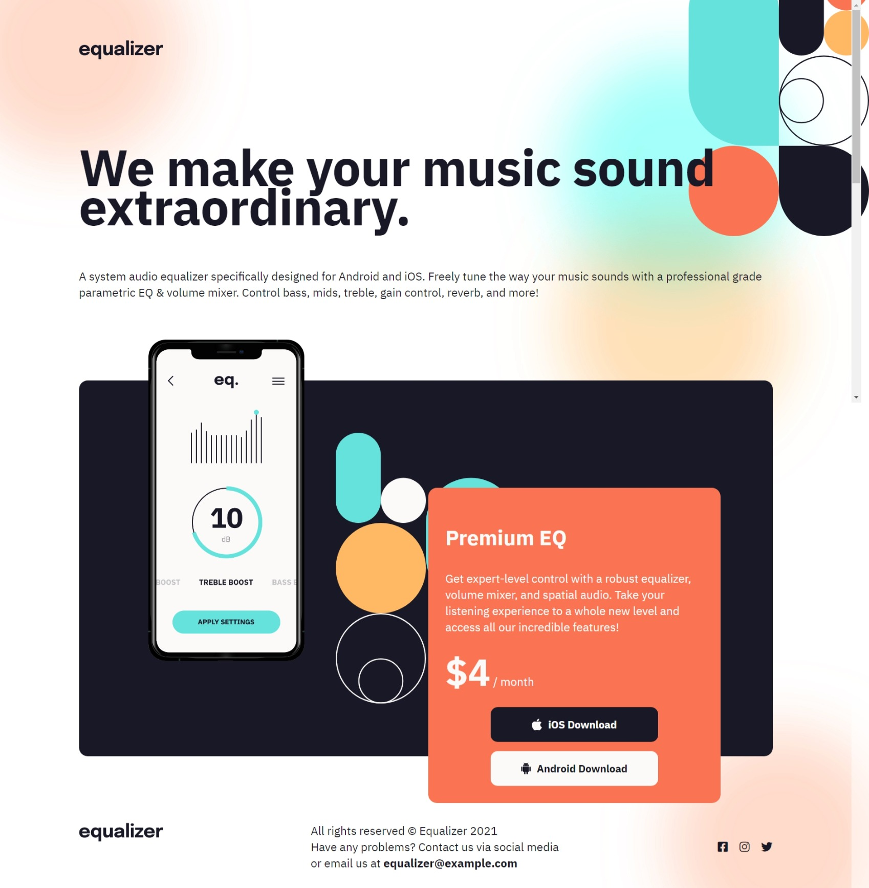

## DOM ASSIGNMENT 6
>BEFORE :-


>HAVE TO DO :-


### TASK 1 : change logo img to ineuron logo img

### TASK 2 :  change the amount for subsription "$4/Month" to "$10/Month"

### TASK 3 : add a linkedin logo footer_social section 

> solution of TASK 1 :

```
// task 1

let changeImg = document.querySelector("header>img");
changeImg.src = "./assets/ineuron-logo.png";
```

> solution of TASK 2 :

```
// task 2

let changeAmount = document.querySelector(".app_price");
changeAmount.innerHTML = "<span>$10</span> / month";
```

> solution of TASK 3 :

```
// task 3 

let linkedin = document.createElement("div");
linkedin.classList.add("footer_social_ico");
let linkedinI = document.createElement("i");
linkedinI.classList.add("fa-brands");
linkedinI.classList.add("fa-linkedin");

linkedin.appendChild(linkedinI);
document.querySelector(".footer_social").appendChild(linkedin);
```